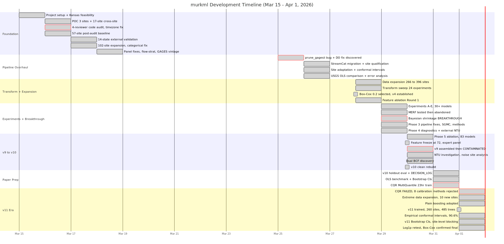

```{=html}
<style>
.diagram-box {
  border: 1px solid #ddd;
  border-radius: 6px;
  overflow: auto;
  max-height: 75vh;
  background: #fafafa;
  padding: 10px;
  margin: 1em 0;
  cursor: grab;
}
.diagram-box:active { cursor: grabbing; }
.diagram-box img {
  min-width: 1400px;
  height: auto;
  display: block;
}
</style>
```

## murkml

Cross-site suspended sediment concentration (SSC) prediction using CatBoost and Bayesian site adaptation.

**Model:** v10-clean-dualbcf — 254 training sites, 72 features, Box-Cox lambda=0.2, dual BCF.

**Author:** Kaleb — University of Idaho, Water Science and Management.

**Paper:** In preparation for Water Resources Research.

**Code:** [github.com/Whiteaeros/murkml](https://github.com/Whiteaeros/murkml)

---

## Project History

Generated from git forensic analysis of 100+ commits (2026-03-15 to 2026-03-31) cross-referenced against DECISION_LOG.md. Scroll and drag to pan each diagram.

### Model Evolution DAG

The ancestry of v10, with every dead-end branch and the state transition that caused each version jump.

::: {.diagram-box}

:::

### Bug Discovery Timeline

Every bug that changed the project trajectory, in chronological order.

::: {.diagram-box}

:::

### Project State Transitions

The narrative arc — how the project evolved through eras, with the key trigger at each transition.

::: {.diagram-box}

:::

### Chronological Project Timeline

Day-by-day progression showing what happened and what was learned.

::: {.diagram-box}

:::

---

## How to Read These Diagrams

**Diagram 1 (Model Evolution DAG)** -- The comprehensive map. Every model version, every investigation branch, every dead end. Follow the main spine from Kansas Feasibility down to v10. Dotted arrows show where investigation findings feed back into the spine. Color legend is in the bottom-right of the diagram.

**Diagram 2 (Bug Timeline)** -- The 18 bugs that shaped the project. Left to right, chronological. Three rows because they came in waves. Color legend is at the bottom.

**Diagram 3 (State Transitions)** -- The narrative arc. How the project evolved through eras, with nested details inside each state. Best for understanding the *story* of the project.

**Diagram 4 (Gantt Timeline)** -- Day-by-day chronological view. Shows how much happened in parallel and where the critical moments fell.

### The Meta-Finding

The project began as a 5-site feasibility test and grew to 254 training sites + 76 holdout + 36 vault in 17 days. The central discovery is that **site heterogeneity is THE problem** -- between-site SSC/turb ratio CV is 3.2x larger than within-site. No architecture, feature, or training change fixes this. The only approach that works is **Bayesian site adaptation** (Student-t shrinkage), which is both the scientific finding and the commercial product.

18 bugs were discovered and fixed along the way. 4 were critical enough to invalidate prior results. The project survived because of systematic practices: red-team reviews (human + Gemini), expert panels, multi-metric evaluation, and the principle of never overwriting model files.
