# murkml Training Pipeline Flowchart

## Overview

The murkml training pipeline converts paired turbidity-SSC observations into a CatBoost regression model that predicts suspended sediment concentration (SSC) from real-time sensor readings and watershed attributes. The pipeline enforces a strict 3-way data split to prevent contamination of evaluation results:

- **Training sites** -- used for cross-validation and final model fitting
- **Holdout-tainted sites** -- used by `evaluate_model.py` for testing; the modeler has seen aggregate metrics from these sites during development, so they are "tainted" but never trained on
- **Vault-sealed sites** -- never touched until final paper submission; provides a truly blind evaluation

The critical contamination guard lives in `train_tiered.py` at two points: once before CV and once before final model training. If any holdout or vault site ID appears in the training data, a `RuntimeError` halts execution immediately. This exists because training on evaluation sites would inflate reported accuracy and produce scientifically invalid results.

The evaluation script (`evaluate_model.py`) loads holdout data independently from the split file and runs Bayesian site adaptation to simulate real-world deployment where a few calibration samples are available at a new site.

## Pipeline Flowchart

```mermaid
flowchart TD
    %% ---------------------------------------------------------------
    %% DATA LOADING
    %% ---------------------------------------------------------------
    A["Load turbidity_ssc_paired.parquet\n(all sites, all samples)"] --> B

    subgraph SPLIT ["3-Way Split Enforcement"]
        B["Load train_holdout_vault_split.parquet"] --> C{"Role == training?"}
        C -- "Yes" --> D["Training sites\n(used for CV + final model)"]
        C -- "Holdout" --> E["Holdout-tainted sites\n(76 sites, seen during dev)"]
        C -- "Vault" --> F["Vault-sealed sites\n(untouched until paper)"]
    end

    D --> G["Auto-exclude holdout + vault\nsamples from assembled data"]
    G --> GUARD

    subgraph GUARD ["HARD GUARD (RuntimeError)"]
        direction TB
        H{"Any holdout/vault site_id\nin training data?"}
        H -- "YES" --> I["RuntimeError:\nCONTAMINATION DETECTED\n-- pipeline halts --"]
        H -- "NO" --> J["Training data verified clean"]
    end

    %% Optional additional exclusion
    OPT["--exclude-sites CSV\n(optional extra exclusions)"] -.-> G

    %% ---------------------------------------------------------------
    %% FEATURE ENGINEERING
    %% ---------------------------------------------------------------
    J --> K["Merge site_attributes.parquet\n(basic: lat, lon, elev, drainage area)"]
    K --> L["Merge StreamCat watershed attrs\n(land cover, soils, geology, anthropogenic)"]
    L --> M["Merge SGMC lithology features\n(28 surficial geology percentages)"]
    M --> N["build_feature_tiers()\nA = sensor-only\nB = sensor + basic\nC = sensor + basic + watershed"]

    N --> O["Apply --drop-features\n(ablation exclusions from\noptimized_drop_list.txt)"]
    O --> P["Apply feature-set filter\n(full / pruned / minimal)"]
    P --> Q["Integrity checks:\n- no all-NaN columns\n- no zero-variance columns\n- categoricals present in Tier C"]

    %% ---------------------------------------------------------------
    %% CROSS-VALIDATION
    %% ---------------------------------------------------------------
    Q --> CV_CHOICE

    subgraph CV ["Cross-Validation Loop"]
        CV_CHOICE{"--cv-mode?"}
        CV_CHOICE -- "logo" --> LOGO["LeaveOneGroupOut\n(one site held out per fold,\n~243 folds)"]
        CV_CHOICE -- "gkf5" --> GKF5["Stratified GroupKFold(5)\n(sites sorted by median SSC,\nround-robin to 5 folds)"]

        LOGO --> FOLD
        GKF5 --> FOLD

        FOLD["Per-fold training:\n1. Box-Cox transform (lambda=0.2 or MLE)\n2. Fill NaN with train-fold median\n3. 85/15 GroupShuffleSplit for early stop\n4. CatBoost(500 iter, depth=6, lr=0.05)\n   with monotone constraints on turbidity\n5. Early stopping (patience=50)\n6. Compute fold BCF (Snowdon)"]

        FOLD --> METRICS["Collect per-fold metrics:\nR2(log), KGE(log), R2(native),\nRMSE(mg/L), %Bias, BCF,\nper-site R2, tree counts"]
    end

    METRICS --> SAVE_CV["Save CV results:\nlogo_folds_{param}_{tier}.parquet\nlogo_predictions_{param}_{tier}.parquet"]

    %% ---------------------------------------------------------------
    %% FINAL MODEL
    %% ---------------------------------------------------------------
    SAVE_CV --> SKIP{"--skip-save-model?"}
    SKIP -- "Yes\n(ablation mode)" --> DONE_CV["Done (metrics only)"]
    SKIP -- "No" --> FINAL

    subgraph FINAL ["Final Model Training"]
        direction TB
        F1["Re-load assembled data\n(training sites only)"] --> F1G
        F1G{"HARD GUARD #2:\nholdout/vault leak check\n(same RuntimeError)"}
        F1G -- "Clean" --> F2
        F2["85/15 GroupShuffleSplit\nfor early stopping validation"] --> F3
        F3["CatBoost final model\n(same hyperparams as CV folds)"] --> F4

        F4["Dual BCF computation:\n1. bcf_mean = Snowdon BCF\n   (mean(obs) / mean(pred))\n2. bcf_median = median(obs/pred)\n   (robust to outliers)"]
    end

    F4 --> SAVE_MODEL

    subgraph SAVE_MODEL ["Model + Metadata Save"]
        S1["Save .cbm model file\n(versioned: {param}_{tier}_{label}.cbm)"]
        S2["Save meta.json:\n- schema_version: 3\n- feature_cols, cat_cols, cat_indices\n- train_median (for NaN imputation)\n- feature_ranges (applicability domain)\n- bcf_mean, bcf_median\n- transform_type, transform_lmbda\n- n_sites, n_samples, n_trees\n- holdout_vault_excluded: true"]
        S1 --- S2
    end

    SAVE_MODEL --> SHAP["SHAP analysis\n(Tier C models only,\nskipped with --skip-shap)"]

    %% ---------------------------------------------------------------
    %% EVALUATION PIPELINE (evaluate_model.py)
    %% ---------------------------------------------------------------
    SHAP --> EVAL_START

    subgraph EVAL ["Evaluation Pipeline (evaluate_model.py)"]
        direction TB
        EVAL_START["Load model .cbm + meta.json"]
        EVAL_START --> EVAL_LOAD

        EVAL_LOAD["load_holdout_data():\n1. Load turbidity_ssc_paired.parquet\n2. Filter to role=='holdout' from split file\n3. Merge basic + StreamCat + SGMC attrs\n4. ASSERT: exactly 76 sites, 5847 samples"]

        EVAL_LOAD --> EVAL_PRED["predict_holdout():\n- Build feature matrix from meta\n- Fill NaN with train_median from meta\n- Model predicts in transformed space\n- Inverse transform + BCF correction"]

        EVAL_PRED --> EVAL_ADAPT["Adaptation curve (per holdout site):\nFor N in [0, 1, 2, 3, 5, 10, 20, 30, 50]:\n  - Use first N samples as calibration\n  - Test on remaining samples\n  - Apply adaptation method:\n    * none (raw model + BCF)\n    * bayesian (Student-t shrinkage)\n    * ols_2param (OLS in model space)\n    * ols_loglog (traditional rating curve)"]

        EVAL_ADAPT --> EVAL_OUT["Output:\n1. {label}_per_reading.parquet\n2. {label}_per_site.parquet\n3. {label}_summary.json\n   (adaptation curve, overall metrics)"]
    end

    %% ---------------------------------------------------------------
    %% ABLATION PATHWAY (phase5_ablation.py)
    %% ---------------------------------------------------------------
    Q --> ABL_START

    subgraph ABLATION ["Ablation Pipeline (phase5_ablation.py)"]
        direction TB
        ABL_START["For each feature:\n  drop-one or add-one experiment"]
        ABL_START --> ABL_RUN["Calls train_tiered.py with:\n--cv-mode gkf5\n--skip-save-model\n--skip-ridge\n--drop-features {feature}\n--exclude-sites exclude_sites_for_ablation.csv"]
        ABL_RUN --> ABL_PARSE["Parse GKF5 metrics from stderr:\nR2(log), KGE(log), R2(native),\nRMSE, Bias, BCF, trees"]
        ABL_PARSE --> ABL_SAVE["Crash-safe incremental save:\nphase5_ablation_screen.parquet\n(atomic write via temp + rename)"]
        ABL_SAVE --> ABL_MODEL["Optional: save quick model\nper experiment (NEVER overwrites\nexisting .cbm files)"]
    end

    %% ---------------------------------------------------------------
    %% STYLING
    %% ---------------------------------------------------------------
    style I fill:#ff4444,color:#fff,stroke:#cc0000
    style GUARD fill:#fff3cd,stroke:#ffc107
    style F1G fill:#fff3cd,stroke:#ffc107
    style SPLIT fill:#e8f4fd,stroke:#2196f3
    style CV fill:#f3e8fd,stroke:#9c27b0
    style FINAL fill:#e8fde8,stroke:#4caf50
    style EVAL fill:#fde8e8,stroke:#f44336
    style ABLATION fill:#fdf8e8,stroke:#ff9800
    style SAVE_MODEL fill:#e8fde8,stroke:#4caf50
```

## Key Safeguards

| Safeguard | Location | What It Prevents |
|-----------|----------|-----------------|
| Auto-exclusion from split file | `train_tiered.py` line ~1013 | Holdout/vault sites silently entering CV training data |
| Hard guard #1 (CV section) | `train_tiered.py` line ~1034 | RuntimeError if any holdout/vault site leaks past exclusion filter |
| Hard guard #2 (final model) | `train_tiered.py` line ~1219 | Same check repeated before final model training (defense in depth) |
| `--include-all-sites` override | `train_tiered.py` line ~939 | Explicit opt-in required to bypass guards (not recommended) |
| Holdout count assertion | `evaluate_model.py` line ~144 | Verifies exactly 76 holdout sites and 5847 samples loaded (catches data drift) |
| NEVER overwrite models | `phase5_ablation.py` line ~199 | Ablation skips model save if `.cbm` already exists |
| Crash-safe parquet writes | `phase5_ablation.py` line ~358 | Atomic write (temp file + rename) prevents partial results on crash |
| Data integrity checks | `train_tiered.py` line ~712 | Warns on all-NaN columns, zero-variance features, missing categoricals (catches prune_gagesii-type bugs) |
