# Refactored train_tiered.py -- Function Structure and Data Flow

## Before vs After

| Aspect | Before (master) | After (refactor/train-tiered) |
|--------|-----------------|-------------------------------|
| **Data loading** | Data loaded twice in `main()` (once for CV, once for final models) with inline loading logic | Data loaded via `load_and_filter_data()` -- called twice but identical logic guaranteed by single function |
| **Contamination guard** | Two separate inline guards (before CV and before final models) | ONE guard inside `load_and_filter_data()` -- every code path goes through it |
| **Target transform** | Inline in `main()`, duplicated for CV and final model sections | Extracted to `apply_target_transform()` -- called from one place per parameter |
| **CV orchestration** | Inline loop in `main()` calling `run_tier()` directly | Extracted to `run_cv()` -- accepts tiers dict and args, returns results |
| **Results logging** | Inline pivot tables and parquet save in `main()` | Extracted to `log_cv_summary()` -- single-responsibility summary printer |
| **Final model training** | Inline in `main()` (~200 lines of model fit + metadata + save) | Extracted to `train_final_models()` -- self-contained with SHAP call |
| **SHAP analysis** | Inline inside final model block | Extracted to `run_shap()` -- takes a trained model and writes outputs |
| **Attribute loading** | Inline in `main()` (basic + StreamCat + SGMC merge) | Extracted to `load_attributes()` -- returns (basic, watershed) tuple |
| **Function count** | ~5 functions + monolithic `main()` | 7 clean entry points + focused `main()` that is just orchestration |

## Refactored Function Decomposition

```mermaid
flowchart TD
    %% ---------------------------------------------------------------
    %% CLI ENTRY POINT
    %% ---------------------------------------------------------------
    CLI["python scripts/train_tiered.py\n--param --tier --transform\n--n-jobs --cv-mode --label\n+ 15 other flags"]
    CLI --> MAIN

    subgraph MAIN ["main()  --  orchestration only"]
        direction TB
        M1["Parse args\nResolve cb_overrides, drop_features"]
        M1 --> M2["load_attributes()"]
        M2 --> M3["For each param in PARAM_CONFIG:"]
        M3 --> M4["load_and_filter_data()"]
        M4 --> M5["apply_target_transform()"]
        M5 --> M6["build_feature_tiers()"]
        M6 --> M7["run_cv()"]
        M7 --> M8{"--skip-save-model?"}
        M8 -- "Yes" --> M9["Done for this param"]
        M8 -- "No" --> M10["load_and_filter_data()\n(same function, same guard)"]
        M10 --> M11["apply_target_transform()"]
        M11 --> M12["build_feature_tiers()"]
        M12 --> M13["train_final_models()"]
        M13 --> M9
        M9 --> M14["log_cv_summary()"]
    end

    %% ---------------------------------------------------------------
    %% FUNCTION: load_and_filter_data
    %% ---------------------------------------------------------------
    subgraph LOAD ["load_and_filter_data(dataset_path, include_all_sites, exclude_sites_csv)"]
        direction TB
        L1["Read assembled parquet"]
        L1 --> L2["Read split file\nExclude holdout + vault site_ids"]
        L2 --> L3["Apply --exclude-sites CSV\n(additional exclusions)"]
        L3 --> L4

        subgraph GUARD ["THE contamination guard"]
            L4{"Any holdout/vault site_id\nstill in data?"}
            L4 -- "YES" --> L5["RuntimeError:\nCONTAMINATION DETECTED"]
            L4 -- "NO" --> L6["Return clean DataFrame"]
        end
    end

    %% ---------------------------------------------------------------
    %% FUNCTION: apply_target_transform
    %% ---------------------------------------------------------------
    subgraph TRANSFORM ["apply_target_transform(assembled, target_col, transform_type, boxcox_lambda)"]
        direction TB
        T1{"transform_type?"}
        T1 -- "log1p" --> T2["No-op (already in parquet)"]
        T1 -- "boxcox" --> T3["boxcox1p(lab_value, lambda)\nlambda from MLE or manual"]
        T1 -- "sqrt" --> T4["sqrt(lab_value)"]
        T1 -- "none" --> T5["Raw lab_value"]
        T2 & T3 & T4 & T5 --> T6["Return (assembled, global_lmbda)"]
    end

    %% ---------------------------------------------------------------
    %% FUNCTION: load_attributes
    %% ---------------------------------------------------------------
    subgraph ATTRS ["load_attributes()"]
        direction TB
        A1["Read site_attributes.parquet\n(basic: lat, lon, elev, area)"]
        A1 --> A2["Read StreamCat attrs\n(land cover, soils, anthropogenic)"]
        A2 --> A3["Merge SGMC lithology\n(28 surficial geology %s)"]
        A3 --> A4["Return (basic_attrs, watershed_attrs)"]
    end

    %% ---------------------------------------------------------------
    %% FUNCTION: run_cv
    %% ---------------------------------------------------------------
    subgraph RUNCV ["run_cv(tiers, param_name, target_col, args, ...)"]
        direction TB
        CV1["For each tier (A, B, C):"]
        CV1 --> CV2["run_tier()\nRidge baseline + CatBoost LOGO/GKF5\nSave per-fold + per-sample parquets"]
        CV2 --> CV3["Return list of per-tier summary dicts"]
    end

    %% ---------------------------------------------------------------
    %% FUNCTION: log_cv_summary
    %% ---------------------------------------------------------------
    subgraph LOGSUMMARY ["log_cv_summary(all_results)"]
        direction TB
        LS1["Build pivot tables:\nR2(log), R2(native), RMSE, %Bias, KGE\nby param x tier"]
        LS1 --> LS2["Print comparison to logger"]
        LS2 --> LS3["Save tiered_comparison.parquet"]
        LS3 --> LS4["Log provenance steps"]
    end

    %% ---------------------------------------------------------------
    %% FUNCTION: train_final_models
    %% ---------------------------------------------------------------
    subgraph FINAL ["train_final_models(tiers, param_name, target_col, transform_type, final_lmbda, args, ...)"]
        direction TB
        F1["For each tier:"]
        F1 --> F2["Apply same feature filtering\n(feature_set, drop_features)"]
        F2 --> F3["85/15 GroupShuffleSplit\nfor early stopping"]
        F3 --> F4["CatBoost final model\n(same hyperparams as CV)"]
        F4 --> F5["Dual BCF:\nbcf_mean (Snowdon/Duan)\nbcf_median (median ratio)"]
        F5 --> F6["Save .cbm model +\nmeta.json (schema v3)\nwith applicability domain"]
        F6 --> F7{"Tier C and\nnot --skip-shap?"}
        F7 -- "Yes" --> F8["run_shap()"]
        F7 -- "No" --> F9["Next tier"]
    end

    %% ---------------------------------------------------------------
    %% FUNCTION: run_shap
    %% ---------------------------------------------------------------
    subgraph SHAP ["run_shap(model, X_df, all_cols, cat_indices, clean, param, tier, results_dir)"]
        direction TB
        SH1["Sample 2000 rows"]
        SH1 --> SH2["TreeExplainer + shap_values"]
        SH2 --> SH3["Save shap_values_{param}_{tier}.parquet\nSave shap_importance_{param}_{tier}.parquet"]
    end

    %% ---------------------------------------------------------------
    %% DATA FLOW ARROWS (between subgraphs)
    %% ---------------------------------------------------------------
    M2 -.->|"(basic_attrs, watershed_attrs)"| ATTRS
    M4 -.->|"dataset_path"| LOAD
    M5 -.->|"assembled + target_col"| TRANSFORM
    M7 -.->|"tiers + args"| RUNCV
    M10 -.->|"same dataset_path"| LOAD
    M11 -.->|"assembled + target_col"| TRANSFORM
    M13 -.->|"tiers + args + cv_results"| FINAL
    M14 -.->|"all_results"| LOGSUMMARY
    F8 -.->|"trained model + data"| SHAP

    %% ---------------------------------------------------------------
    %% STYLING
    %% ---------------------------------------------------------------
    style L5 fill:#ff4444,color:#fff,stroke:#cc0000
    style GUARD fill:#fff3cd,stroke:#ffc107
    style MAIN fill:#f0f0f0,stroke:#666
    style LOAD fill:#e8f4fd,stroke:#2196f3
    style TRANSFORM fill:#e8f4fd,stroke:#2196f3
    style ATTRS fill:#e8f4fd,stroke:#2196f3
    style RUNCV fill:#f3e8fd,stroke:#9c27b0
    style LOGSUMMARY fill:#f3e8fd,stroke:#9c27b0
    style FINAL fill:#e8fde8,stroke:#4caf50
    style SHAP fill:#fdf8e8,stroke:#ff9800
```

## Key Structural Improvement

The contamination guard now lives in exactly ONE function (`load_and_filter_data`). Every code path that touches training data -- CV and final model training alike -- calls that function. There is no way to load data without hitting the guard, and no way for the two loading sites to diverge in behavior.

## Function Signatures (quick reference)

| Function | Inputs | Returns |
|----------|--------|---------|
| `load_and_filter_data` | dataset_path, include_all_sites, exclude_sites_csv | Filtered DataFrame (holdout/vault removed) |
| `apply_target_transform` | assembled, target_col, transform_type, boxcox_lambda | (assembled, global_lmbda) |
| `load_attributes` | (none) | (basic_attrs, watershed_attrs) |
| `run_cv` | tiers, param_name, target_col, args, transform_type, global_lmbda, ... | list[dict] of per-tier summaries |
| `log_cv_summary` | all_results | (none -- prints + saves parquet) |
| `train_final_models` | tiers, param_name, target_col, transform_type, final_lmbda, args, ... | (none -- saves .cbm + meta.json) |
| `run_shap` | model, X_df, all_cols, cat_indices, clean, param, tier, results_dir | (none -- saves parquets) |
